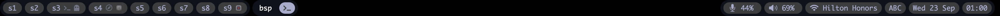

# obi

**SketchyBar for yabai. Inspired by simple-bar.**

A native, opinionated macOS status bar for [yabai](https://github.com/koekeishiya/yabai):
one 28 px strip over the hidden system menu bar, spaces with app icons, the focused
space's windows, and a fixed row of data widgets that only show up when something is
worth looking at. One Swift binary, no Electron, no WebView, no Node, no polling scripts.



*obi* (帯) is the paper band wrapped around a Japanese book. It pairs with yabai.

## Why

[simple-bar](https://github.com/Jean-Tinland/simple-bar) on Übersicht looks great, but it costs a
WebView, a Node server, a second Node process for events, and shell scripts polling `top`,
`netstat`, `system_profiler` and `defaults read` every few hundred milliseconds. obi keeps the
look and the workflow and replaces the machinery with AppKit and system APIs:

| | simple-bar + Übersicht | obi |
|---|---|---|
| Processes | Übersicht, its Node server, simple-bar-server | one `obi` |
| yabai events | HTTP → WebSocket → JS re-query | HTTP → debounced re-query |
| CPU / memory / network | `top`, `memory_pressure`, `netstat -w1` | `host_processor_info`, `sysctl`, `getifaddrs` |
| Volume | `osascript` every 20 s | CoreAudio |
| Keyboard layout | `defaults read` every 200 ms | TIS notification |
| Idle cost | a WebKit process | < 1 % CPU, ~60 MB |

## What it shows

**Spaces.** Every space of every display, filtered by label. Each pill shows the label (or
index) and one icon per app with windows there; the focused app's icon is brighter. Focused,
visible and fullscreen states. Click focuses the space, Alt+click renames its label inline.

**Process.** Windows of the space that has focus, on any display. Layout badge (`bsp` /
`stack` / `float`) and a mode badge fed by Hammerspoon or skhd (`{"mode","color"}`). Click
focuses the window.

**Data widgets** (order is fixed):

| Widget | Shows | Hidden when | Interval | Click |
|---|---|---|---|---|
| zoom | mic / camera state during a zoom.us meeting | not in a meeting | 5 s | |
| netstats | ↓ ↑ rates | both below threshold (1500 kb/s) | 2 s | |
| cpu | user CPU % | below threshold (50 %) | 2 s | Activity Monitor |
| memory | used % (red above 70) | below threshold (50 %) | 4 s | |
| mic | input volume, unfolding slider on hover | | 20 s | drag |
| sound | output volume, unfolding slider on hover | | 20 s | drag |
| wifi | SSID | Wi‑Fi off | 20 s | right click → Network settings |
| keyboard | layout name, 3 chars | | on change | |
| date | `Wed 23 Sep` | | 30 s | Calendar |
| time | `HH:mm` | | minute boundary | |

Thresholds are the point: cpu, memory and network widgets stay out of the way until they are
hot. Data keeps being collected while a widget is hidden.

## Requirements

- macOS 14+, Apple Silicon or Intel
- yabai with the scripting addition (SIP partially disabled)
- The system menu bar set to auto-hide (`System Settings → Control Center → Automatically
  hide and show the menu bar`) and yabai configured with `external_bar main:0:0`. obi draws in
  the strip the hidden menu bar leaves free and does not reserve space.

## Install

```sh
git clone https://github.com/hmepas/obi.git && cd obi
scripts/deploy.sh          # release build → ~/.local/bin/obi → launchd agent com.hmepas.obi
```

`obi install` writes `~/Library/LaunchAgents/com.hmepas.obi.plist` and bootstraps it;
`obi uninstall` removes it. Both are idempotent. Re-run `scripts/deploy.sh` after every
change: it replaces the binary by rename, which matters because overwriting a running
executable in place makes macOS kill the next launch.

### yabai signals

Point yabai at obi from `~/.yabairc`. Endpoints are simple-bar-server compatible, so an
existing `simple-bar-conf.sh` works as is once the Übersicht `osascript refresh` line is gone.

```sh
for ev in window_focused window_created window_destroyed window_resized window_minimized \
          window_deminimized window_title_changed application_activated; do
  yabai -m signal --add event=$ev action="curl -s localhost:7776/yabai/windows/refresh"
done
for ev in space_changed space_created space_destroyed display_changed; do
  yabai -m signal --add event=$ev action="curl -s localhost:7776/yabai/spaces/refresh"
done
for ev in display_added display_removed display_moved; do
  yabai -m signal --add event=$ev action="curl -s localhost:7776/yabai/displays/refresh"
done
```

### Mode badge (Hammerspoon / skhd)

Write `{"mode": "app_launch", "color": "red"}` to the mode file (default
`~/Library/Caches/obi/mode`). obi watches the file, so the
badge updates without any request; `curl localhost:7776/skhd/mode/refresh` also works. An
empty mode hides the badge. Colors are palette names: `red`, `green`, `yellow`, `orange`,
`blue`, `magenta`, `cyan`, `white`, `foreground`.

## Configuration

`~/.config/obi/config.toml`. Missing file means defaults; a parse error is logged and the bar
starts with defaults anyway.

```toml
theme = "material-ocean"
yabai = "/opt/homebrew/bin/yabai"
port = 7776
mode_file = "~/Library/Caches/obi/mode"

[spaces]
exclude = ["s16", "sC", "sM"]        # exact label match
apps_exclude = ["Wispr Flow"]        # case-insensitive; floating panels are always hidden

[icons]                              # app → glyph instead of the app icon
iTerm2 = "svg:terminal"              # svg:<builtin>  built-ins: terminal, ghostty, safari
Ghostty = "svg:ghostty"              # svg:<path.svg> your own monochrome SVG
Safari = "safari"                    # anything else is an SF Symbol name

[widgets.cpu]
threshold = 50
[widgets.memory]
threshold = 50
[widgets.netstats]
threshold = 1500                     # kb/s
[widgets.keyboard]
max_length = 3
[widgets.wifi]
device = "en0"
```

Reload without restarting: `obi reload`, or `kill -HUP $(pgrep -x obi)`.

## CLI and HTTP

```
obi [--port N] [--offset PX] [--config PATH]    run the bar (what launchd calls)
obi install | uninstall                         manage the launchd agent
obi reload                                      re-read the config, rebuild widgets
obi theme <name>                                switch theme at runtime
obi refresh spaces|windows|displays|mode        poke a refresh
```

| `GET 127.0.0.1:7776` | |
|---|---|
| `/yabai/{spaces,windows,displays}/refresh` | re-query yabai (debounced 20 ms) |
| `/skhd/mode/refresh` | re-read the mode file |
| `/config/reload` | reload config |
| `/theme/<name>` | switch theme |
| `/health` | `ok` |

## Running next to an existing bar

```sh
obi --port 7778 --offset 28 --config ./dev-config.toml   # 28 px lower, own port
scripts/dev-signals.sh add 7778                          # yabai signals for this instance
scripts/dev-signals.sh remove
```

## Design

- Swift 5 language mode, AppKit, SwiftPM, no dependencies, no Xcode project. Build with
  `swift build` (Xcode toolchain).
- A widget is a class with a view and `start`/`stop`. Data widgets subclass `PollingWidget`:
  `fetch()` on a utility queue, `render()` on main. Adding one is a file plus a line in
  `WidgetRegistry`.
- Theme is a value (palette, roles, font, metrics). Widgets never see color literals.
- Config and theme changes rebuild every widget; nothing hot-patches itself.
- HTTP is `NWListener` plus a hand-parsed request line. TOML is a strict subset with its own
  parser, but the file is valid TOML.


## Not planned

Themes beyond Material Ocean, light mode, floating or bottom bars, multiple bars, graphs,
media / weather / battery / GitHub widgets, a settings UI, plugins, AeroSpace or skhd
key handling, SIP-enabled setups.

## Credits

Layout, palette and the terminal / ghost / compass glyphs come from
[simple-bar](https://github.com/Jean-Tinland/simple-bar) by Jean Tinland (MIT).
[SketchyBar](https://github.com/FelixKratz/SketchyBar) was the reference for talking to macOS.
